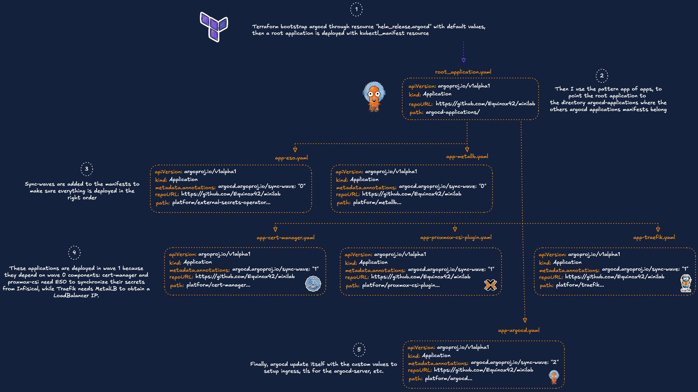
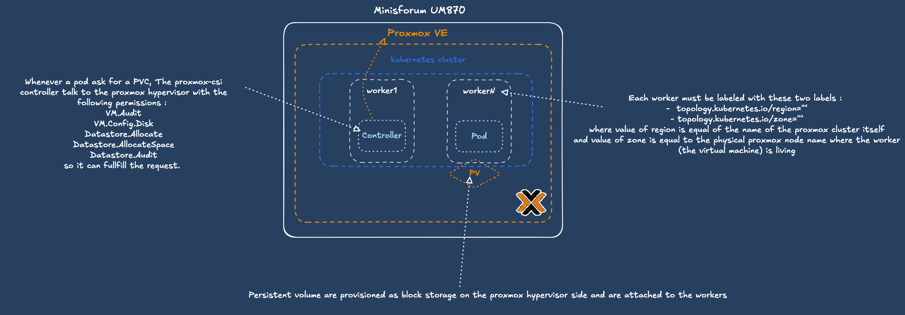

## Goals

This repository documents my homelab setup. The infrastructure I run, the tools I use, and the decisions behind them.
It's a sandbox where I can experiment with differents cloud native technologies. 


## Tech Stack 

<table>
    <tr>
        <th>Logo</th>
        <th>Name</th>
        <th>Description</th>
    </tr>
    <tr>
        <td></td>
        <td><a href="https://www.proxmox.com">Proxmox VE</a></td>
        <td>Open source hypervisor and virtualization platform</td>
    </tr>
    <tr>
        <td></td>
        <td><a href="https://developer.hashicorp.com/terraform">Terraform</a></td>
        <td>Infrastructure as Code provisioning tool</td>
    </tr>
    <tr>
        <td></td>
        <td><a href="https://kubernetes.io">Kubernetes</a></td>
        <td>Container-orchestration system</td>
    </tr>
    <tr>
        <td></td>
        <td><a href="https://k0sproject.io/">k0s</a></td>
        <td>Lightweight single-binary Kubernetes distribution</td>
    </tr>
    <tr>
        <td></td>
        <td><a href="https://helm.sh">Helm</a></td>
        <td>Package manager and template engine for Kubernetes</td>
    </tr>
    <tr>
        <td></td>
        <td><a href="https://argoproj.github.io/cd">ArgoCD</a></td>
        <td>GitOps continuous delivery tool for Kubernetes</td>
    </tr>
    <tr>
        <td></td>
        <td><a href="https://traefik.io/">Traefik</a></td>
        <td>Cloud native reverse proxy and ingress controller</td>
    </tr>
    <tr>
        <td></td>
        <td><a href="https://cert-manager.io">Cert-Manager</a></td>
        <td>Cloud native certificate management</td>
    </tr>
    <tr>
        <td></td>
        <td><a href="https://external-secrets.io/">External Secrets Operator</a></td>
        <td>Synchronizes secrets from external stores into Kubernetes</td>
    </tr>
    <tr>
        <td></td>
        <td><a href="https://infisical.com/">Infisical</a></td>
        <td>Open source secret management platform</td>
    </tr>
    <tr>
        <td></td>
        <td><a href="https://adguard.com/adguard-home.html">AdGuard Home</a></td>
        <td>Network-wide DNS ad blocking and local DNS resolver</td>
    </tr>
    <tr>
        <td></td>
        <td><a href="https://grafana.com">Grafana</a></td>
        <td>Observability platform</td>
    </tr>
    <tr>
        <td></td>
        <td><a href="https://grafana.com/oss/loki">Loki</a></td>
        <td>Log aggregation system</td>
    </tr>
    <tr>
        <td></td>
        <td><a href="https://victoriametrics.com/">VictoriaMetrics</a></td>
        <td>Systems monitoring and alerting toolkit</td>
    </tr>
    <tr>
        <td></td>
        <td><a href="https://gethomepage.dev/">Homepage</a></td>
        <td>Highly customizable application dashboard</td>
    </tr>

## Infrastructure

My current homelab is built around a single physical node: a Minisforum UM870 equipped with 96GB of RAM, a AMD Ryzen 7 8745H and 1 TB SSD. 

In the future i'd like to invest in a dedicated NAS. This will allow me to decouple my persistent data from the compute node.


## Provisioning & Bootstrapping Kubernetes Cluster

I use Terraform to automate the creation of my Kubernetes cluster. The cluster runs on k0s, a lightweight, single-binary distribution. The deployment is split into two phases: infrastructure provisioning and cluster bootstrapping.


Virtual machines are provisioned on Proxmox through the `bpg/proxmox` provider, using a custom local Terraform module (`./modules/kubernetes-cluster`). The module clones a pre-built cloud-init Debian template.

```hcl
module "k8s_cluster" {
  source = "./modules/kubernetes-cluster"

  cluster_name     = "management"
  kubernetes_nodes = var.kubernetes_nodes
  username         = var.username
  template_id      = var.template_id
  ssh_key          = var.ssh_key
  gateway          = var.gateway
  proxmox_node     = var.proxmox_node
}
```

Each node is declared in the `kubernetes_nodes` variable:

```hcl
variable "kubernetes_nodes" {
  type = map(object({
    ip     = string
    cpu    = number
    memory = number
    role   = string
  }))
}
```

### Cluster Bootstrapping (k0sctl)

Once the VMs are up, the cluster is bootstrapped with `k0sctl`. The k0sctl manifest is generated dynamically with Terraform's `templatefile()` function, which iterates over the same `kubernetes_nodes` variable used to provision the VMs.

```hcl
resource "local_file" "k0sctl_config" {
  filename        = "${path.module}/../k0s/generated/k0sctl-${module.k8s_cluster.cluster_name}.yaml"
  file_permission = "0600"

  content = templatefile("${path.module}/../k0s/k0sctl.yaml.tftpl", {
    cluster_name         = "mini-k0s-${module.k8s_cluster.cluster_name}"
    ssh_user             = var.username
    ssh_private_key_path = var.ssh_private_key_path
    k0s_version          = var.k0s_version
    nodes                = var.kubernetes_nodes
    proxmox_csi_region   = var.proxmox_csi_region
    proxmox_csi_zone     = var.proxmox_csi_zone
  })
}
```

A `terraform_data` resource then runs a local script (`k0s_init.sh`) which polls SSH on every node before invoking `k0sctl apply`.

```hcl
resource "terraform_data" "k0s_bootstrap" {
  depends_on       = [module.k8s_cluster, local_file.k0sctl_config]
  triggers_replace = [local_file.k0sctl_config.content]

  provisioner "local-exec" {
    command = "bash ${abspath("${path.module}/../k0s/k0s_init.sh")}"
    environment = {
      MANIFEST_PATH = abspath(local_file.k0sctl_config.filename)
      CLUSTER_NAME  = "mini-k0s-${module.k8s_cluster.cluster_name}"
      NODE_IPS      = join(",", module.k8s_cluster.all_ips)
      SSH_USER      = var.username
      SSH_KEY_PATH  = var.ssh_private_key_path
      DEBUG         = true
    }
  }
}
```

> **Note**: I'm aware that `local-exec` is generally considered an anti-pattern in Terraform as it breaks idempotency. I made this trade-off since I'm the only operator on this project. I'm planning to switch to either k0smotron or CAPI with a Proxmox infrastructure provider to provision additional clusters.

## Handling Sensitive Variables

I manage sensitive variables with the help of direnv, which automatically loads environment variables defined in a .envrc file when entering a directory.

```bash
# .envrc
export TF_VAR_api_token="pve!terraform@pve!xxxxxxxx"
export TF_VAR_proxmox_hostname="https://192.168.x.x:8006/"
export TF_VAR_ssh_key="$(< ~/.ssh/id_rsa.pub)"
```

Read more at https://direnv.net/

## Secret Management with Infisical


Infisical is my secret store, used to centralize sensitive data (API tokens, credentials) consumed by the cluster through the External Secrets Operator. It runs **outside** the Kubernetes cluster on a dedicated Proxmox VM. 

It's an open source alternative to HashiCorp Vault which is centered around the developer experience.

Two Docker Compose stacks run side by side on the VM : 

- [`docker-compose.traefik.yaml`](./docker_compose/traefik/docker-compose.traefik.yaml) - Traefik as a reverse proxy, handling TLS termination with Let's Encrypt certificates.
- [`docker-compose.infisical.yaml`](./docker_compose/infisical/docker-compose.infisical.yaml) - the Infisical backend, with Redis for caching and PostgreSQL for storage.


> **Note**: These stacks are currently deployed manually. I plan to migrate them to Ansible playbooks for declarative provisioning. Ideally I'd like to run Infisical, PostgreSQL and as systemd units rather than containers.

Once Infisical is running, I manage its resources with the [Infisical Terraform provider](https://registry.terraform.io/providers/Infisical/infisical/latest). 

Secrets are created with `infisical_secret` using the `value_wo` (write-only) argument, so their values are never stored in the Terraform state.

## Bootstrapping Applications with ArgoCD

ArgoCD is installed by Terraform via `helm_release`, then a root Application is deployed with `kubectl_manifest`. This root Application follows the **App-of-Apps pattern**: it points to a directory containing all the other ArgoCD Application manifests.

Each Application is annotated with sync-waves to ensure the correct deployment order:

- **Wave 0**: External Secrets Operator, MetalLB : these two charts don't have any dependancies. 

- **Wave 1**: cert-manager, Proxmox CSI, Traefik : these charts either depend on ESO for secrets synchronization or MetalLB for LoadBalancer IPs

- **Wave 2**: ArgoCD self-managed, it update itself with final values (Ingress, TLS, etc.)




Once bootstrapped, all changes to the applications go through Git. Terraform no longer touches anything inside the cluster.


## Storage with Proxmox CSI

Persistent storage in the cluster is handled by the Proxmox CSI Plugin, a Container Storage Interface driver that provisions Kubernetes PersistentVolumes directly on Proxmox storage.

I chose this solution because all my VMs run on the same physical node with a single SSD. Solutions like Longhorn or Rook-Ceph would provide high availability but the failure domain is the same regardless. 

