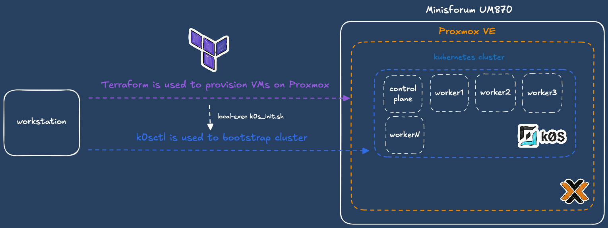

## Goals

This repository has several purposes. First, it acts as a showcase of the technologies and practices I’m currently experimenting with, learning, and deploying in my homelab. 

It also serves as a structured place to document what I build and how I build it, it is a complement to my Obsidian vault, but in a format I can easily share and reference publicly. Ultimately, this repo is both a learning space and a long-term knowledge base for my tooling.

## Infrastructure

My current homelab is built around a single physical node: a Minisforum UM870 equipped with 96GB of RAM, a AMD Ryzen 7 8745H and 1 TB SSD. 

The host typically runs severals Debian VMs provisioned from cloud-ready images, which serve as the foundation for my Kubernetes environments (usually deploying k0s or standard k8s via Kubespray).

In the future i'd like to invest in a dedicated NAS. This will allow me to decouple my persistent data from the compute node and introduce much-needed storage redundancy.

## Provisioning & Bootstrapping Kubernetes Clusters

To automate the creation of Kubernetes environments, the deployment is split into two main phases: infrastructure provisioning and cluster bootstrapping.




### Infrastructure Provisioning (Terraform)

Virtual machines are provisioned on Proxmox using a custom local Terraform module (.terraform/modules/kubernetes). This module deploys cloud-ready Debian images which are already templated, it usually takes less than 20 seconds to provision theses VMs. Node specifications—such as hostname, IP address, CPU, and memory allocation are defined and passed through a variable map. I usually reuse this module to provision ephemeral development cluster to test/debug things.

```hcl
module "k8s_cluster_prod" {
  source           = "./modules/kubernetes-cluster"
  environment      = "prod"
  kubernetes_nodes = var.kubernetes_nodes_prod
  # ... other variables
}
```

### Cluster Bootstrapping (k0sctl)

Once the VMs are provisioned, the kubernetes cluster is bootstrapped using k0s with the k0sctl manifest. To bridge Terraform's provisioning state with the bootstrapping process, a terraform_data resource is utilized. This triggers a local bash script (k0s_init.sh) using a local-exec provisioner. 

```hcl
resource "terraform_data" "k0s_bootstrap" {
  depends_on = [module.k8s_cluster_prod]

  provisioner "local-exec" {
    command = "bash ${abspath("${path.module}/../k0s/k0s_init.sh")}"
    environment = {
      MANIFEST_PATH = abspath("${path.module}/../k0s/k0sctl.yaml")
      CLUSTER_NAME  = "mini-k0s-${module.k8s_cluster_prod.environment}"
      CONTROLLER_IP = var.kubernetes_nodes_prod["control-plane"].ip
      # ... worker IPs
    }
  }
}
```
[NOTE] I'm aware that the use of `local-exec` may not be the best decision since it's an anti-pattern and breaks state idempotency. However, it was a pragmatic choice since I'm the only one working on this project. It provides a simple, low-friction bridge to hand over the newly provisioned VMs.