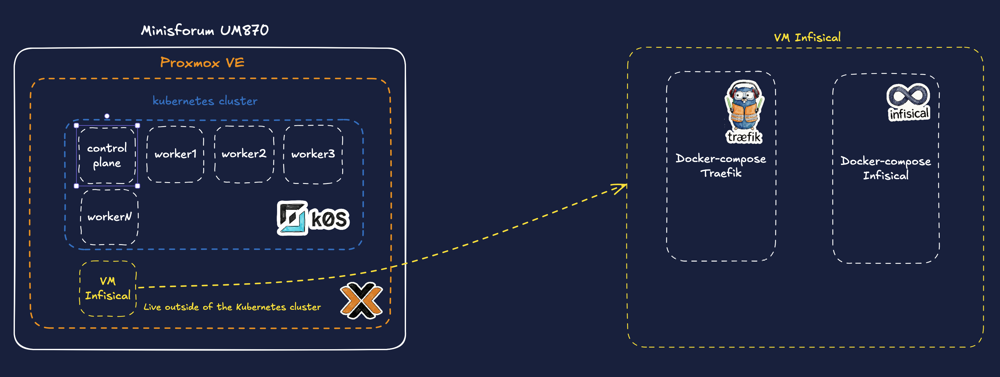

## Goals

This repository has several purposes. First, it acts as a showcase of the technologies and practices I’m currently experimenting with, learning, and deploying in my homelab. 

It also serves as a structured place to document what I build and how I build it, it is a complement to my Obsidian vault, but in a format I can easily share.

## Infrastructure

My current homelab is built around a single physical node: a Minisforum UM870 equipped with 96GB of RAM, a AMD Ryzen 7 8745H and 1 TB SSD. 

In the future i'd like to invest in a dedicated NAS. This will allow me to decouple my persistent data from the compute node.

## Provisioning & Bootstrapping Kubernetes Cluster

I use Terraform to automate the creation of my Kubernetes cluster. The cluster runs on k0s, a lightweight, single-binary distribution. The deployment is split into two phases: infrastructure provisioning and cluster bootstrapping.


Virtual machines are provisioned on Proxmox through the `bpg/proxmox` provider, using a custom local Terraform module (`./modules/kubernetes-cluster`). The module clones a pre-built cloud-init Debian template.

```hcl
module "k8s_cluster" {
  source = "./modules/kubernetes-cluster"

  cluster_name     = "management"
  kubernetes_nodes = var.kubernetes_nodes
  username         = var.username
  template_id      = var.template_id
  ssh_key          = var.ssh_key
  gateway          = var.gateway
  proxmox_node     = var.proxmox_node
}
```

Each node is declared in the `kubernetes_nodes` variable:

```hcl
variable "kubernetes_nodes" {
  type = map(object({
    ip     = string
    cpu    = number
    memory = number
    role   = string
  }))
}
```

### Cluster Bootstrapping (k0sctl)

Once the VMs are up, the cluster is bootstrapped with `k0sctl`. The k0sctl manifest is generated dynamically with Terraform's `templatefile()` function, which iterates over the same `kubernetes_nodes` variable used to provision the VMs.

```hcl
resource "local_file" "k0sctl_config" {
  filename        = "${path.module}/../k0s/generated/k0sctl-${module.k8s_cluster.cluster_name}.yaml"
  file_permission = "0600"

  content = templatefile("${path.module}/../k0s/k0sctl.yaml.tftpl", {
    cluster_name         = "mini-k0s-${module.k8s_cluster.cluster_name}"
    ssh_user             = var.username
    ssh_private_key_path = var.ssh_private_key_path
    k0s_version          = var.k0s_version
    nodes                = var.kubernetes_nodes
    proxmox_csi_region   = var.proxmox_csi_region
    proxmox_csi_zone     = var.proxmox_csi_zone
  })
}
```

A `terraform_data` resource then runs a local script (`k0s_init.sh`) which polls SSH on every node before invoking `k0sctl apply`.

```hcl
resource "terraform_data" "k0s_bootstrap" {
  depends_on       = [module.k8s_cluster, local_file.k0sctl_config]
  triggers_replace = [local_file.k0sctl_config.content]

  provisioner "local-exec" {
    command = "bash ${abspath("${path.module}/../k0s/k0s_init.sh")}"
    environment = {
      MANIFEST_PATH = abspath(local_file.k0sctl_config.filename)
      CLUSTER_NAME  = "mini-k0s-${module.k8s_cluster.cluster_name}"
      NODE_IPS      = join(",", module.k8s_cluster.all_ips)
      SSH_USER      = var.username
      SSH_KEY_PATH  = var.ssh_private_key_path
      DEBUG         = true
    }
  }
}
```

> **Note**: I'm aware that `local-exec` is generally considered an anti-pattern in Terraform as it breaks idempotency. I made this trade-off since I'm the only operator on this project. I'm planning to switch to either k0smotron or CAPI with a Proxmox infrastructure provider to provision additional clusters.


## Secret Management with Infisical


Infisical is my secret store, used to centralize sensitive data (API tokens, credentials) consumed by the cluster through the External Secrets Operator. It runs **outside** the Kubernetes cluster on a dedicated Proxmox VM. 

It's an open source alternative to HashiCorp Vault which is centered around the developer experience.

Two Docker Compose stacks run side by side on the VM : 

- [`docker-compose.traefik.yaml`](./docker_compose/traefik/docker-compose.traefik.yaml) - Traefik as a reverse proxy, handling TLS termination with Let's Encrypt certificates.
- [`docker-compose.infisical.yaml`](./docker_compose/infisical/docker-compose.infisical.yaml) - the Infisical backend, with Redis for caching and PostgreSQL for storage.





> **Note**: These stacks are currently deployed manually. I plan to migrate them to Ansible playbooks for declarative provisioning. Ideally I'd like to run Infisical, PostgreSQL and as systemd units rather than containers.
